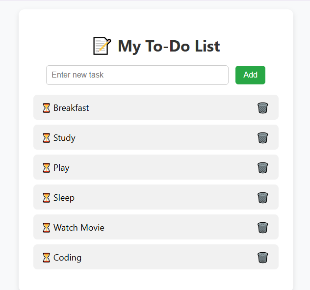

# Flask To-do App

A simple and stylish web-based To-Do list application built using **Flask** and **Python**. Users can add tasks, view their to-do list, and delete tasks all with a clean UI and emoji enhancements.

---

##  Features

- Add new tasks with a single click
- Remove tasks easily
- Built using Flask, HTML, and CSS
- Runs locally on your system

---

##  Project Structure

```
flask_todo_app/
├── app.py
├── static/
│   └── style.css
├── templates/
│   └── index.html
```

---

##  Setup Instructions

### 1. Clone or Download the Project

```bash
cd Downloads
mkdir flask_todo_app
cd flask_todo_app
```

Or manually place the files in `Downloads/flask_todo_app`.

### 2. Create & Activate Virtual Environment

```bash
python -m venv venv
venv\Scripts\activate  # Windows
# OR
source venv/bin/activate  # Mac/Linux
```

### 3. Install Dependencies

```bash
pip install Flask
```

### 4. Run the Flask App

```bash
python app.py
```

Then open your browser and go to:

```
http://127.0.0.1:5000/
```

---

## Screenshot



---

## Tech Stack

- **Backend**: Python, Flask
- **Frontend**: HTML, CSS
- **Icons/Emojis**: Unicode emojis

---

## Future Improvements

- Add SQLite database for permanent storage
- Add "Mark as Done" functionality 
- User login system
- Deploy the app on Render / Railway
